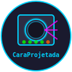
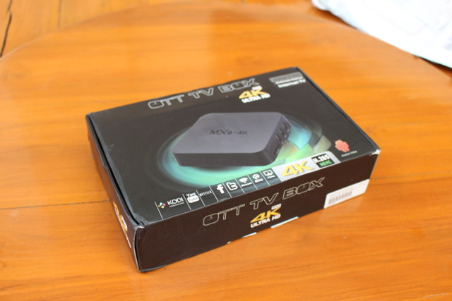

<p align="center">
  
</p>

<h1 align="center">🎯 CaraProjetada</h1>

<p align="center">
  <strong>Subsistema inteligente de projetores multi-sala com autenticação institucional</strong>
</p>

<p align="center">
  <a href="https://github.com/Deivisan/caraprojetada"></a>
  <a href="#"></a>
  <a href="#"></a>
  <a href="#"></a>
  <a href="https://dave-san.github.io/caraprojetada"></a>
</p>

---

## 🌐 Documentação Online

Acesse a documentação completa e interativa:

| Página | Descrição |
|--------|-----------|
| **[🏠 Início](docs/index.html)** | Visão geral e funcionalidades |
| **[🏗️ Arquitetura](docs/arquitetura.html)** | Diagramas e fluxos técnicos |
| **[📚 Tutoriais](docs/tutoriais.html)** | Passo a passo para usuários |
| **[🚀 Instalação](docs/setup.html)** | Deploy e configuração |
| **[🗺️ Roadmap](docs/roadmap.html)** | Plano de desenvolvimento |

---

## 🏗️ Arquitetura Multi-Projetor

### Visão Geral

```
┌─────────────────────────────────────────────────────────────────────────────┐
│                        DASHBOARD CENTRAL (Web)                             │
│                   http://projetores.intranet.ufrb.edu.br                    │
│                                                                             │
│  ┌────────────┐  ┌────────────┐  ┌────────────┐  ┌────────────┐          │
│  │   SALA A   │  │   SALA B   │  │   SALA C   │  │   SALA D   │          │
│  │  172.17.x.x│  │ 172.17.x.x │  │ 172.17.x.x │  │ 172.17.x.x │          │
│  │   [CONECTAR]│  │ [CONECTAR] │  │ [CONECTAR] │  │ [CONECTAR] │          │
│  └──────┬─────┘  └──────┬──────┘  └──────┬──────┘  └──────┬──────┘          │
└─────────┼───────────────┼─────────────────┼─────────────────┼─────────────────┘
          ▼               ▼                 ▼                 ▼
┌─────────────────┐ ┌─────────────────┐ ┌─────────────────┐ ┌─────────────────┐
│   PROJETOR A    │ │   PROJETOR B    │ │   PROJETOR C    │ │   PROJETOR D    │
│   RK3229        │ │   RK3229        │ │   RK3229        │ │   RK3229        │
│   192.168.1.101 │ │   192.168.1.102 │ │   192.168.1.103 │ │   192.168.1.104 │
│   ┌───────────┐ │ │   ┌───────────┐ │ │   ┌───────────┐ │ │   ┌───────────┐ │
│   │ xtightvnc │ │ │   │ xtightvnc │ │ │   │ xtightvnc │ │ │   │ xtightvnc │ │
│   │ viewer    │ │ │   │ viewer    │ │ │   │ viewer    │ │ │   │ viewer    │ │
│   └─────┬─────┘ │ │   └─────┬─────┘ │ │   └─────┬─────┘ │ │   └─────┬─────┘ │
│         ▼       │ │         ▼       │ │         ▼       │ │         ▼       │
│   ┌───────────┐ │ │   ┌───────────┐ │ │   ┌───────────┐ │ │   ┌───────────┐ │
│   │ Flask API │ │ │   │ Flask API │ │ │   │ Flask API │ │ │   │ Flask API │ │
│   │ (porta 80)│ │ │   │ (porta 80)│ │ │   │ (porta 80)│ │ │   │ (porta 80)│ │
│   └─────┬─────┘ │ │   └─────┬─────┘ │ │   └─────┬─────┘ │ │   └─────┬─────┘ │
│         ▼       │ │         ▼       │ │         ▼       │ │         ▼       │
│   ┌───────────┐ │ │   ┌───────────┐ │ │   ┌───────────┐ │ │   ┌───────────┐ │
│   │ LightDM   │ │ │   │ LightDM   │ │ │   │ LightDM   │ │ │   │ LightDM   │ │
│   │ Xorg :0   │ │ │   │ Xorg :0   │ │ │   │ Xorg :0   │ │ │   │ Xorg :0   │ │
│   └───────────┘ │ │   └───────────┘ │ │   └───────────┘ │ │   └───────────┘ │
└─────────────────┘ └─────────────────┘ └─────────────────┘ └─────────────────┘
```

### 🔐 Fluxo de Autenticação

```
Usuario          Dashboard            AD Server
   │                 │                    │
   │  1. GET /          │                    │
   │ ───────────────────►│                    │
   │                 │  2. HTML Login        │
   │ ◄───────────────────│                    │
   │                 │                    │
   │  3. POST /login      │                    │
   │ ───────────────────►│                    │
   │                 │  4. LDAP bind          │
   │                 │ ───────────────►       │
   │                 │ ◄──────────────OK       │
   │ ◄───────────────────│                    │
   │                 │  5. HTML Dashboard     │
   │                 │  (lista salas)          │
```

### 🖥️ Fluxo de Conexão VNC

```
Usuario          Projetor (A)
   │                 │
   │  6. POST /sala/a/conectar         │
   │ ───────────────────────────────►│
   │                 │  7. Killa viewer antigo │
   │                 │     (se existir)        │
   │                 │  8. Executa:            │
   │                 │     xtightvncviewer      │
   │                 │     <IP_USUARIO>:0       │
   │                 │     -autopass (123456)  │
   │                 │ ───────────────────────►│
   │  9. VNC Server (UltraVNC)               │
   │ ◄═════════════════════════════════════════►│
   │      Tela do notebook no projetor
```

---

## 📊 Hardware Target

### Rockchip RK3229 TV Box

| Componente | Especificação |
|------------|---------------|
| **SoC** | Rockchip RK3229, 28nm |
| **CPU** | 4x Cortex-A7 @ 1.5 GHz |
| **GPU** | Mali-400 MP2 |
| **RAM** | 1 GB DDR3 |
| **eMMC** | 8 GB |
| **Rede** | 10/100 Ethernet + Wi-Fi |
| **USB** | 3x USB 2.0 |
| **Vídeo** | HDMI 2.0 (4K@60fps) |



---

## 📦 Estrutura do Projeto

```
caraprojetada/
├── app/
│   ├── app.py              # Flask server + VNC control + AD auth
│   └── requirements.txt    # Flask, LDAP3
├── scripts/
│   ├── kiosk.sh            # Chromium kiosk mode
│   ├── totem_guardian.sh   # System health guardian
│   ├── totem_watchdog.sh   # Periodic watchdog
│   ├── totem_reset.sh      # Emergency reset
│   ├── start_rtsp.sh       # RTSP camera streaming
│   └── build-kernel.sh     # Kernel building (CaraAzul)
├── systemd/
│   ├── projetor.service    # Flask service (port 80)
│   └── stream-cam.service  # RTSP streaming service
├── docs/
│   ├── index.html          # Landing page
│   ├── arquitetura.html    # Documentação técnica
│   ├── tutoriais.html      # Tutoriais de uso
│   ├── setup.html          # Guia de instalação
│   ├── roadmap.html        # Roadmap de desenvolvimento
│   ├── css/style.css       # Estilos
│   ├── js/main.js          # JavaScript
│   ├── _config.yml         # GitHub Pages config
│   └── .nojekyll           # Bypass Jekyll
├── assets/
│   └── images/             # Imagens do hardware
├── exports/                # Configurações exportadas
└── README.md
```

---

## 🎯 Como Construir uma Imagem SD

### Passo 1: Baixar o Armbian

```bash
# Acesse: https://www.armbian.com/
# Baixe a imagem para RK3229
wget https://apt.armbian.com/armbian.key
sudo apt-key add armbian.key
echo "deb http://apt.armbian.com $(lsb_release -cs) main" | sudo tee /etc/apt/sources.list.d/armbian.list
```

### Passo 2: Flash da Imagem

```bash
# Instale o balenaEtcher ou use dd
sudo dd if=armbian-rk3229.img of=/dev/sdX bs=4M status=progress
sync
```

### Passo 3: Primeiro Boot

```bash
# Conecte HDMI, teclado e rede
# Aguarde 2-3 minutos
# Acesse via SSH:
ssh root@192.168.1.100
# Senha padrão: 123456
```

### Passo 4: Configuração Inicial

```bash
# Altere a senha
passwd

# Configure a rede
nano /etc/network/interfaces

# Atualize o sistema
apt update && apt upgrade -y
```

---

## 🔧 Comandos Úteis

```bash
# SSH direto
ssh caraprojetada@172.17.28.179

# Status do projetor
ssh caraprojetada 'systemctl status projetor'

# Logs do VNC
ssh caraprojetada 'tail -f /var/log/vnc.log'

# Kiosk manual
ssh caraprojetada 'DISPLAY=:0 chromium --kiosk https://www.uol.com.br/'

# Verificar IP
ip a
```

---

## 📋 Roadmap de Desenvolvimento

### Fase 1: Baseline (✅ Concluída)
- [x] Flask app com autenticação AD
- [x] Conexão VNC reversa
- [x] Kiosk Chromium
- [x] Watchdog e Guardian
- [x] Streaming RTSP

### Fase 2: Estabilização (🔄 Em Andamento)
- [ ] Migrar para kernel 6.6+ (via CaraAzul)
- [ ] Substituir xfwm4 por openbox
- [ ] Adicionar fallback ethernet
- [ ] Logs centralizados
- [ ] Backup automático

### Fase 3: Multi-Projetor (📋 Planejado)
- [ ] Dashboard central web
- [ ] Descoberta automática (mDNS)
- [ ] Configuração remota via API
- [ ] Agendamento de horários

### Fase 4: Segurança (🔒 Planejado)
- [ ] HTTPS com certificado
- [ ] Rate limiting no login
- [ ] Logs de auditoria
- [ ] Fail2ban SSH

### Fase 5: Features Avançadas (🚀 Futuro)
- [ ] Múltiplos usuários simultâneos
- [ ] Streaming de áudio
- [ ] Modo apresentação
- [ ] Miracast/AirPlay
- [ ] App mobile

---

## 🤝 Como Contribuir

1. **Fork o repositório**
2. **Clone localmente**
   ```bash
   git clone https://github.com/seu-usuario/caraprojetada.git
   ```
3. **Crie uma branch**
   ```bash
   git checkout -b feature/nova-feature
   ```
4. **Faça suas alterações**
5. **Commit e push**
   ```bash
   git commit -m "feat: descrição da feature"
   git push origin feature/nova-feature
   ```
6. **Abra um Pull Request**

---

## 📄 Licença

MIT License - use livremente para desenvolvimento e produção.

---

<p align="center">
  <a href="https://github.com/Deivisan/caraprojetada">github.com/Deivisan/caraprojetada</a>
</p>