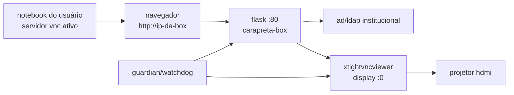

<p align="center">
  
</p>

<h1 align="center">🎯 caraprojetada</h1>

<p align="center">
  <strong>projetor institucional embarcado em rk3229 · produção estável · ad/ldap · vnc reverso</strong>
</p>

<p align="center">
  
  
  
  
  
</p>

<p align="center">
  <a href="#-visão-geral">visão geral</a> ·
  <a href="#-arquitetura-de-produção">arquitetura</a> ·
  <a href="#-fluxo-de-uso">fluxo</a> ·
  <a href="#-desempenho">desempenho</a> ·
  <a href="#-migração-dev--main">migração</a>
</p>

---

## ✨ visão geral

`caraprojetada` transforma uma tv box **rockchip rk3229** em um ponto de projeção institucional. o usuário acessa a interface web, autentica com credenciais da instituição e a box abre uma conexão **vnc reversa** para exibir a tela do notebook no projetor hdmi.

esta branch `main` representa a base estável de produção. recursos novos da `dev` — como tela idle `/projetor`, emulação `/vnc-view` e ajustes visuais — devem entrar aqui somente depois de teste real na rede e no hardware.

> ✅ objetivo da `main`: estabilidade, autenticação real, vnc real e mudanças pequenas/reversíveis.

---

## 🧭 arquitetura de produção



fallback textual:

```text
notebook → navegador → flask :80 → ad/ldap → xtightvncviewer → hdmi/projetor
```

---

## 🧱 stack atual

| camada | produção |
|---|---|
| hardware | rockchip rk3229, armv7, ~1 gb ram |
| sistema | armbian bullseye, kernel 4.4 legacy |
| app | flask em `app/app.py` |
| porta | `80` |
| autenticação | ad/ldap institucional |
| projeção | vnc reverso com `xtightvncviewer` |
| display | xorg `:0` + lightdm + wm leve |
| recuperação | `totem_guardian.sh`, `totem_watchdog.sh`, `totem_reset.sh` |

---

## 🔐 fluxo de uso

1. usuário inicia servidor vnc local no notebook.
2. usuário acessa `http://<ip-da-box>/`.
3. informa siape/usuário e senha institucional.
4. flask valida via ad/ldap.
5. painel detecta ip e sistema operacional.
6. usuário clica em **conectar tela ao projetor**.
7. a box encerra viewer antigo, se houver.
8. a box executa `xtightvncviewer` no display `:0`.
9. o projetor hdmi mostra a tela do notebook.
10. usuário desconecta pelo painel ao finalizar.

---

## 🛣️ endpoints atuais

| método | rota | descrição |
|---|---|---|
| `GET` | `/` | login ou painel |
| `POST` | `/login` | autenticação ad/ldap |
| `POST` | `/logout` | encerra sessão web |
| `POST` | `/conectar` | inicia conexão vnc reversa |
| `POST` | `/desconectar` | encerra viewer e libera projetor |
| `GET` | `/api/v1/status` | status json do projetor |
| `POST` | `/api/v1/force-disconnect` | força liberação via api |

> recursos experimentais da `dev` devem ser promovidos com cuidado: `/projetor`, `/vnc-view`, modo dev, telas novas e migração openbox.

---

## 📦 estrutura

```text
caraprojetada/
├── app/
│   ├── app.py              # flask, ad/ldap e controle vnc
│   └── requirements.txt    # flask + ldap3
├── scripts/
│   ├── kiosk.sh            # chromium fullscreen opcional
│   ├── totem_guardian.sh   # recuperação frequente
│   ├── totem_watchdog.sh   # watchdog periódico
│   ├── totem_reset.sh      # reset gráfico emergencial
│   └── start_rtsp.sh       # rtsp opcional
├── systemd/
│   ├── projetor.service    # serviço flask porta 80
│   └── stream-cam.service  # serviço rtsp opcional
├── docs/                   # documentação html
├── assets/                 # imagens e logos
├── AGENTS.md               # instruções locais para agentes
├── PERFORMANCE.md          # checklist de desempenho
├── SPEC.md                 # especificação técnica
└── README.md
```

---

## 🧰 deploy / operação

dependências principais no alvo:

```bash
sudo apt update
sudo apt install -y python3 python3-flask python3-ldap3 xtightvncviewer xserver-xorg-core lightdm x11-utils
```

serviço principal:

```bash
sudo systemctl status projetor --no-pager
sudo systemctl restart projetor
```

comando vnc executado pela aplicação:

```bash
echo "123456" | DISPLAY=:0 sudo /usr/bin/xtightvncviewer <ip-do-usuario>:<display> -autopass
```

---

## ⚡ desempenho

o rk3229 é limitado. toda mudança visual, novo serviço ou nova dependência precisa ser medida no hardware real antes de entrar em produção.

| métrica | alvo inicial |
|---|---|
| cpu idle | `< 5%` |
| ram app sem vnc | `< 120 mb` |
| ram com vnc ativo | observar swap e estabilidade |
| temperatura | ideal `< 75°c` |
| tempo de conexão vnc | `< 3s` após clique |
| espaço livre em `/` | `> 1 gb` |

detalhes em [`PERFORMANCE.md`](./PERFORMANCE.md).

---

## 🧪 comandos úteis

```bash
# ssh
ssh caraprojetada

# status serviço
ssh caraprojetada 'systemctl status projetor --no-pager'

# logs do app
ssh caraprojetada 'tail -f /var/log/projetor-acessos.log'

# recursos
ssh caraprojetada 'uptime; free -h; df -h /; cat /sys/class/thermal/thermal_zone0/temp'

# processos gráficos
ssh caraprojetada 'pgrep -a "Xorg|lightdm|xfwm4|openbox|chromium|xtightvncviewer"'

# api status
curl -s http://172.17.28.179/api/v1/status | python3 -m json.tool
```

---

## 🔁 migração dev → main

regras para amanhã quando estiver na rede:

- testar na box real antes de promover.
- validar login ad/ldap real.
- validar vnc real com notebook servidor.
- medir cpu, ram e temperatura.
- migrar em commits pequenos.
- evitar merge grande da `dev` inteira.

---

## 🧩 roadmap próximo

- [ ] validar dev no hardware real dentro da rede ufrb.
- [ ] medir tela idle `/projetor` antes de promover.
- [ ] melhorar telas e menus.
- [ ] migrar openbox gradualmente.
- [ ] revisar logs e auditoria.
- [ ] manter kernel 6.6/caraazul fora do escopo imediato.

<p align="center">
  <strong>caraprojetada</strong> · ufrb/cetens · rk3229 · main branch
</p>
