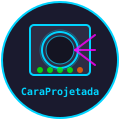

<p align="center">
  
</p>

<h1 align="center">🎯 caraprojetada</h1>

<p align="center">
  <strong>projetor institucional embarcado em rk3229 · flask · webrtc · ad/ldap</strong>
</p>

<p align="center">
  
  
  
  
  
</p>

---

## ✨ visão geral

`caraprojetada` transforma uma tv box **rockchip rk3229** em um ponto de projeção institucional: o usuário acessa uma interface web, autentica com credenciais institucionais e transmite a tela do navegador para o projetor via **webrtc** (socket.io + rtcpeerconnection).

> ✅ arquitetura atual: webrtc (não vnc reverso).  
> ✅ branch `dev`: desenvolvimento ativo.  
> ❌ projeto descontinuado: **caraazul**.  

---

## 🧭 mapa do sistema

```mermaid
flowchart LR
  user[notebook do usuário<br/>navegador] --> login[/login]
  login --> dashboard[dashboard<br/>webrtc presenter]
  dashboard -->|screen capture| pc[rtcpeerconnection]
  pc -->|websocket/sdp/ice| socket[socket.io]
  socket --> display[/display<br/>chromium kiosk]
  display --> hdmi[projetor hdmi]
```

---

## 🧱 arquitetura atual

| camada | branch dev |
|--------|-----------|
| app web | `app/app.py`, flask + socket.io + webrtc (~535 linhas) |
| autenticação | mock em `dev`; ad/ldap em produção |
| captura de tela | `getDisplayMedia()` no navegador (webrtc) |
| sinalização | socket.io (offer, answer, ice-candidate) |
| tela do projetor | `/display`, chromium kiosk, playback webrtc |
| display | xorg `:0` + lightdm + openbox |
| hardware alvo | rk3229, armv7, ~1 gb ram |
| dependências python | flask, flask-socketio, ldap3 |

---

## 🚀 modo dev local

rode fora da rede da ufrb, sem tocar na box real:

```bash
cd app
CARAPROJETADA_ENV=dev flask --app app:app run --host 127.0.0.1 --port 5000
```

### login dev

| usuário | senha | observação |
|---------|-------|-----------|
| `admin` | `admin` | administrador mock |
| qualquer usuário | `dev` | login rápido |
| `usuario` | `usuario` | usuário=senha |

### fluxo de teste

```text
1. abrir http://127.0.0.1:5000/
2. login admin/admin
3. dashboard → clicar "Compartilhar Tela"
4. autorizar captura de tela no navegador
5. abrir http://127.0.0.1:5000/display (outra aba = projetor)
6. confirmar vídeo ao vivo
7. clicar "Parar Compartilhamento"
8. /display volta ao estado ocioso
```

---

## 🖥️ telas

### `/display` — tela do projetor (kiosk)

tela exibida no hdmi 24/7 pelo chromium kiosk. mostra:

| elemento | função |
|----------|--------|
| identidade ufrb | universidade federal do recôncavo |
| status | disponível / em transmissão |
| relógio | atualizado a cada 60s |
| vídeo webrtc | playback fullscreen quando ativo |
| dot pulsante | verde (livre) / amarelo (ocupado) |

### `/dashboard` — painel do professor

após login, lista as salas disponíveis e permite compartilhar tela via webrtc.

| elemento | função |
|----------|--------|
| grid de salas | cards com nome, instituição, status |
| botão "Compartilhar Tela" | inicia `getDisplayMedia()` + webrtc |
| botão "Parar Compartilhamento" | encerra a transmissão |
| indicators | socket conectado, status da sala |
| feedback | mensagens smart de conexão/erro |

---

## 🛣️ rotas

| método | rota | modos | descrição |
|--------|------|-------|-----------|
| `GET` | `/` | dev/prod | redireciona conforme sessão |
| `GET` | `/login` | dev/prod | tela de login institucional |
| `POST` | `/login` | dev/prod | autentica usuário (ad/ldap ou mock) |
| `GET` | `/dashboard` | dev/prod | painel com salas e webrtc presenter |
| `GET` | `/display` | dev/prod | tela do projetor (chromium kiosk) |
| `GET` | `/api/v1/status` | dev/prod | status json da aplicação |

### eventos socket.io

| evento | emissor | descrição |
|--------|---------|-----------|
| `join` | ambos | entra na sala (sala ou 'tvbox' no display) |
| `offer` | display receptor | sdp offer do projetor |
| `answer` | dashboard presenter | sdp answer do professor |
| `ice-candidate` | ambos | troca de ice candidates |
| `session-start` | dashboard | marca sessão ativa na sala |
| `session-end` | dashboard | encerra sessão |
| `heartbeat` | display | ping de vida a cada 15s |

---

## 📦 estrutura

```text
caraprojetada/
├── app/
│   ├── app.py                 # flask + socket.io + webrtc (~535 linhas)
│   ├── requirements.txt       # flask, flask-socketio, ldap3
│   ├── templates/
│   │   ├── login.html         # tela de login institucional
│   │   ├── dashboard.html     # painel webrtc presenter
│   │   └── display.html       # tela projetor (chromium kiosk)
│   └── static/                # assets estáticos
├── scripts/                   # scripts de sistema da box
├── docs/                      # documentação técnica
├── assets/                    # logos e imagens
├── AGENTS.md                  # instruções locais para agentes
├── SPEC.md                    # especificação técnica
├── PERFORMANCE.md             # metas de desempenho
└── README.md
```

---

## ⚡ desempenho

| métrica | alvo inicial |
|---------|-------------|
| cpu idle flask | `< 5%` |
| memória sem stream | `< 120 mb` |
| memória com stream webrtc | `< 180 mb` somando chromium |
| temperatura | ideal `< 75°c` |
| conexão webrtc | `< 5s` para estabelecer |
| polling da tela idle | não agressivo, hoje 60s (relógio) |

detalhes em [`PERFORMANCE.md`](./PERFORMANCE.md).

---

## 🧪 comandos úteis

```bash
# verificar sintaxe
python3 -m py_compile app/app.py

# status dev
curl -s http://127.0.0.1:5000/api/v1/status | python3 -m json.tool

# recursos no hardware real
ssh caraprojetada 'free -h; uptime; df -h /; cat /sys/class/thermal/thermal_zone0/temp'
```

---

## 🔒 notas de segurança

- manter o repositório privado.
- não promover `CARAPROJETADA_ENV=dev` para produção.
- não expor credenciais ou dados sensíveis.
- validar ad/ldap real antes de qualquer merge para `main`.

---

<p align="center">
  <strong>caraprojetada</strong> · ufrb/cetens · rk3229 · dev branch
</p>
