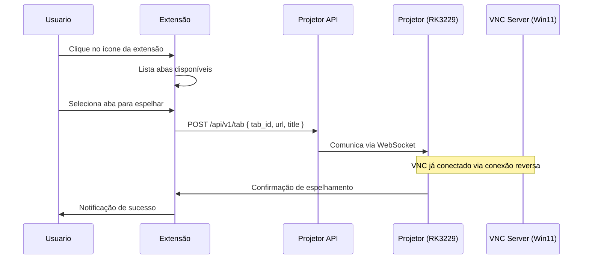

# Extensão do Navegador - CaraProjetada TabMirror

## Visão Geral

A extensão permite ao usuário **selecionar qual aba específica** do navegador deseja espelhar no projetor, substituindo a abordagem atual de espelhamento total da tela.

## Arquitetura

### Componentes

```
browser-extension/
├── manifest.json          # Config da extensão (Chrome/Firefox)
├── background/
│   └── background.js      # Service worker - conectividade com projetor
├── content/
│   └── content.js         # Script injetado - detecção de abas
├── popup/
│   ├── popup.html         # Interface do usuário
│   ├── popup.js           # Lógica do popup
│   └── popup.css
├── icons/
│   └── icon-[16|48|128].png
└── api/
    └── client-api.js      # Comunicação com API RESTful
```

## Fluxo de Funcionamento



## API Endpoints (a implementar)

### `POST /api/v1/tab`
```json
{
  "tab_id": "abc123",
  "url": "https://docs.google.com/presentation/d/...",
  "title": "Apresentação TCC",
  "window_id": 123,
  "timestamp": "2026-05-28T12:00:00Z"
}
```

### `GET /api/v1/status`
```json
{
  "connected": true,
  "projector_ip": "192.168.1.101",
  "current_tab": "abc123",
  "users_online": ["notebook-deivi", "notebook-joao"]
}
```

### `POST /api/v1/heartbeat`
```json
{
  "hostname": "DEIVI-NOTE",
  "ip": "172.17.28.100",
  "available_tabs": ["tab1", "tab2"]
}
```

## Implementação Técnica

### Manifest V3 (Chrome/Chromium)

```json
{
  "manifest_version": 3,
  "name": "CaraProjetada TabMirror",
  "version": "1.0.0",
  "permissions": ["tabs", "activeTab", "storage"],
  "host_permissions": ["http://projetores.intranet.ufrb.edu.br/*"],
  "background": {
    "service_worker": "background/background.js"
  },
  "action": {
    "default_popup": "popup/popup.html",
    "default_icon": {
      "16": "icons/icon-16.png",
      "48": "icons/icon-48.png",
      "128": "icons/icon-128.png"
    }
  },
  "content_scripts": [{
    "matches": ["<all_urls>"],
    "js": ["content/content.js"]
  }]
}
```

### Detecção de Abas

```javascript
// content.js
chrome.runtime.onMessage.addListener((request, sender, sendResponse) => {
  if (request.action === 'getTabs') {
    chrome.tabs.query({}, (tabs) => {
      const availableTabs = tabs.map(tab => ({
        id: tab.id,
        title: tab.title,
        url: tab.url,
        active: tab.active,
        favIconUrl: tab.favIconUrl
      }));
      sendResponse({ tabs: availableTabs });
    });
  }
});
```

## Integração com VNC

### Estratégia de Espelhamento

1. **Modo 1: Aba específica via URL**
   - Extensão envia URL da aba selecionada
   - Projetor abre URL em nova janela do Chromium (kiosk)
   - VNC continua transmitindo tela inteira, mas projetor mostra só a aba

2. **Modo 2: Múltiplas janelas VNC (futuro)**
   - Cada aba em janela separada
   - VNC viewer no projetor gerencia múltiplas sessões

3. **Modo 3: Extensão no projetor**
   - O próprio projetor tem extensão instalada
   - Abre URL diretamente sem precisar do VNC do PC